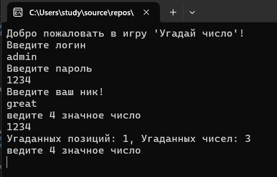
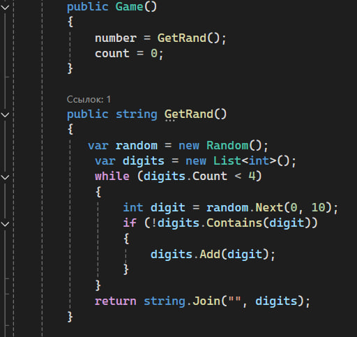

# Игра "Угадай число"

Это простая консольная игра "Угадай число", написанная на C#. Цель игры — угадать загаданное компьютером четырехзначное число.

## Описание игры

Перед началос игры пользователю необходимо ввести свой логин пароль. Если найдется совпадение с полями логин пароль в файле users.json, то пользователю будет дозволенно начать игру.

Далее игрок вводит свое имя и пытается угадать четырехзначное число. Компьютер дает подсказки, указывая, сколько цифр угадано правильно и находятся на правильных местах. Игра продолжается до тех пор, пока игрок не угадает число.

## Лидеры

Список лидеров хранится в файле leaderboard.json. Вы можете просмотреть список лидеров, выбрав соответствующий пункт в меню.

## Подробное обьяснение метода генерации случайного числа

В игре используется случайное четырехзначное число без повторяющихся цифр. Генерация числа происходит следующим образом:

1. **Конструктор класса `Game`:**
   - При создании объекта класса `Game` вызывается конструктор, который инициализирует два поля `number` и `count`.
   - `number` — это случайное четырехзначное число без повторяющихся цифр, которое генерируется в методе `GetRand()`.
   - `count` — это счетчик попыток.

2. **Метод `GetRand()`:**
   - Создается объект `Random` для генерации случайных чисел.
   - Создается список `digits`, который будет хранить цифры.
   - В цикле while происходит генерация цифр до тех пор, пока в списке `digits` не будет 4 уникальных цифры.
   - В каждом проходе цикла генерируется случайная цифра от 0 до 9 с помощью метода `random.Next(0, 10)`.
   - Если сгенерированная цифра еще не содержится в списке `digits`, она будет добавлена  в список.
   - Метод `string.Join("", digits)` объединяет цифры в строку и возвращает ее.
  
  

  

